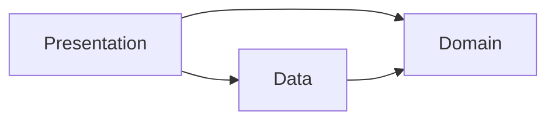

# KidQuiz

A kid-friendly trivia quiz for the web and Android. Pick a topic — Science, General
Knowledge, or Math — answer five easy questions against a countdown timer, and land on
a per-category leaderboard. Questions come from the [Open Trivia DB](https://opentdb.com/)
with a curated offline question bank as a fallback when the network is unavailable.

**Play it:** _[itch.io](https://itsinb5.itch.io/kidquiz)_


## Architecture

Three layers, dependencies point inward only — Presentation depends on Domain and Data;
Domain depends on nothing.



- **Domain** — pure C#, no `UnityEngine` reference: `Question`, `QuizSession`,
  `ScoringRules`, the `IQuestionProvider`/`IRandomizer` interfaces.
- **Data** — HTTP clients and repositories: `ApiClient` (UnityWebRequest over
  async/await), `TriviaApiProvider`, `LocalQuestionProvider`, `FirebaseScoreRepository`.
- **Presentation** — MonoBehaviours and UI: `GameManager` (composition root),
  the four screens, `AudioManager`.

## Setup

The Firebase leaderboard needs a Realtime Database URL that isn't committed to the repo.

1. Create a Firebase project with a Realtime Database (test mode is fine for a demo).
2. Copy `Assets/Resources/FirebaseConfig.example.asset` to
   `Assets/Resources/FirebaseConfig.asset` and set `Database Url` to your instance's URL.
3. Set these database rules so each topic's leaderboard is queryable and capped:
   ```json
   { "rules": { "scores": { ".read": true, ".write": true, "$category": { ".indexOn": "score" } } } }
   ```

Without a `FirebaseConfig.asset`, the game runs fine — the leaderboard just always
reports "unavailable."

## Technical decisions

**Why Domain has no `UnityEngine` reference.** Scoring rules, question shuffling, and
session state are the parts most worth unit-testing and least likely to need Unity's
APIs. Keeping them in a plain-C# assembly means the EditMode tests run in milliseconds
with no scene, no Play mode, and no Unity dependency at all.

**Why async/await for network and coroutines for timing.** WebGL has no threads —
`Task.Run` and blocking waits aren't options — so `UnityWebRequest` is awaited directly
via `async`/`await`, which composes cleanly with cancellation tokens. Coroutines are used
only where frame-based timing is the actual point, like the countdown bar's per-frame fill.

**Why a decorator for offline fallback.** `FallbackQuestionProvider` wraps the live
`TriviaApiProvider` and the offline `LocalQuestionProvider` behind the same
`IQuestionProvider` interface. `GameManager` calls `FetchAsync` once and never knows or
cares which source answered — a dropped connection degrades to the offline bank
transparently instead of branching logic through the caller.

## Known limitations

- **Client-authoritative scoring.** The score is calculated on-device and submitted as-is;
  nothing stops a modified client from submitting an inflated score. Fixing this means
  moving scoring to a server (or Cloud Function) that re-derives the score from the
  submitted answers and timestamps.
- **Permissive database rules.** The rules above allow anyone to read and write any
  category's leaderboard. Fine for a demo, not for production — a real deployment needs
  auth-gated writes and server-side validation.

## What's next

- Player accounts (currently name-only, no persistence across devices).
- Server-side scoring to close the client-authoritative gap above.
- Hebrew RTL localization.

## Deliberately not doing

- No accounts — player name only.
- Portrait only — one layout for both targets.
- No Docker, no CI — nothing here needs them.
